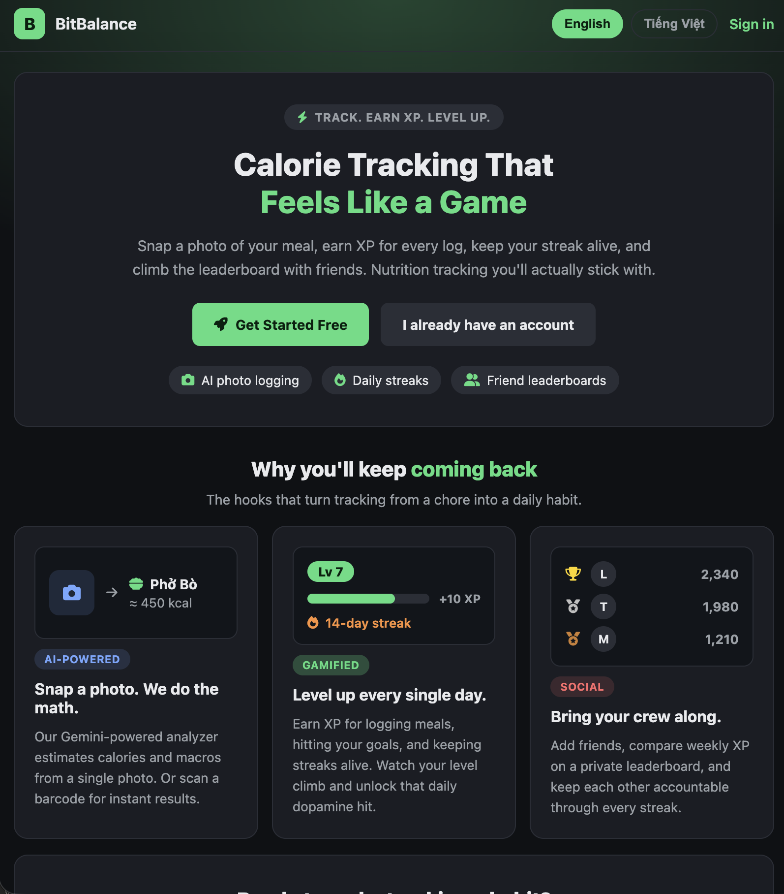
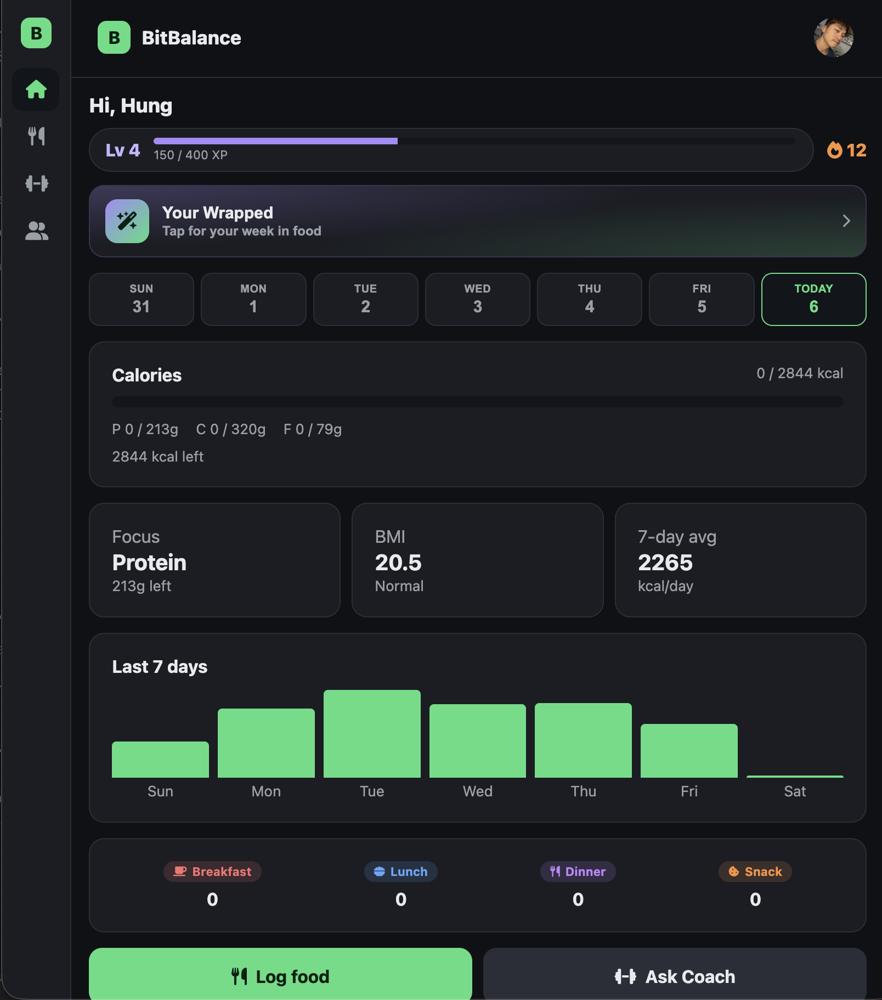
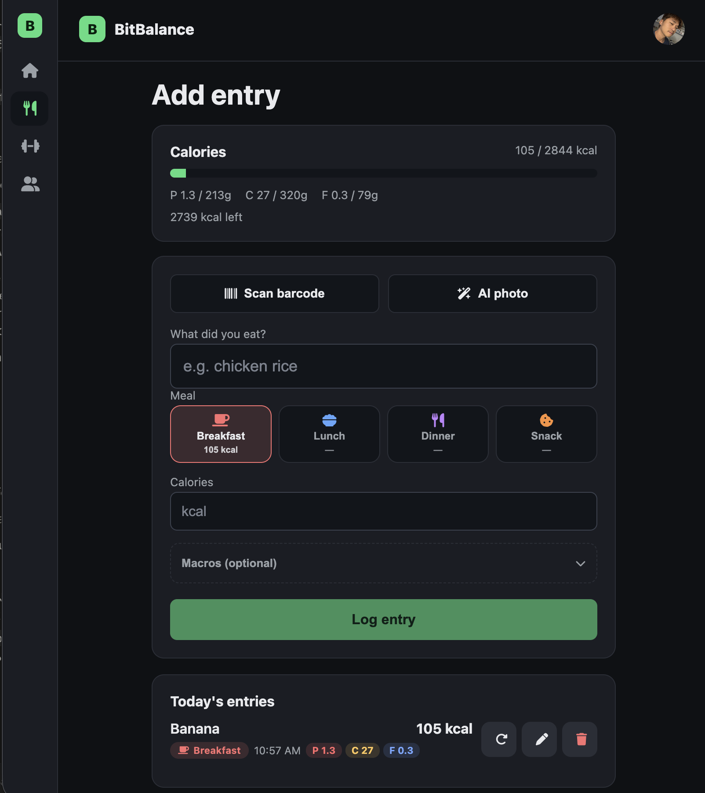
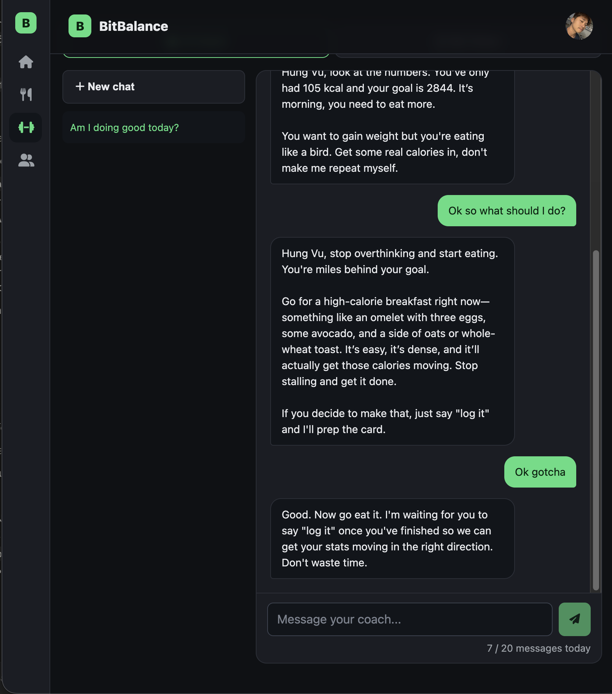
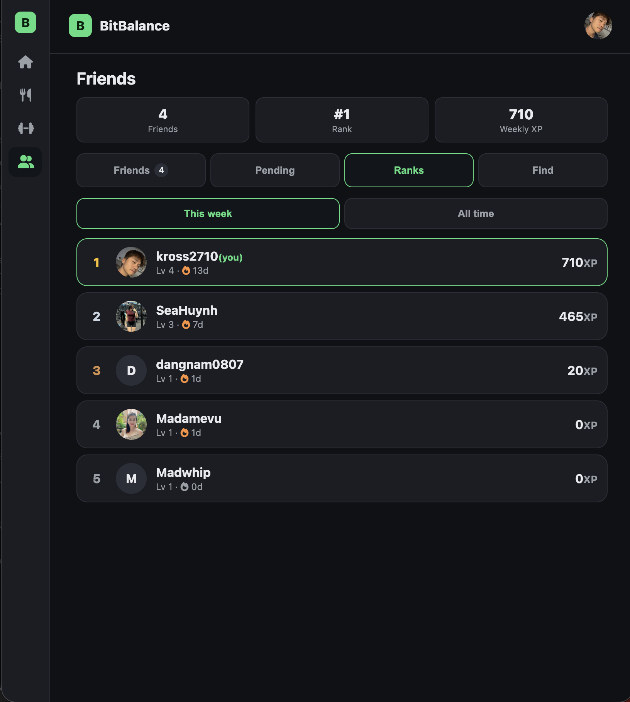
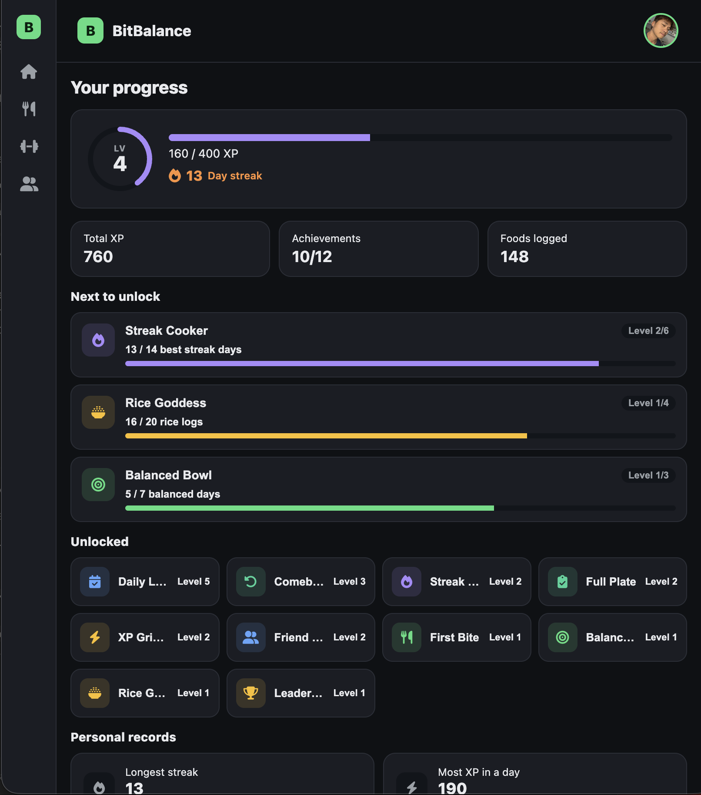
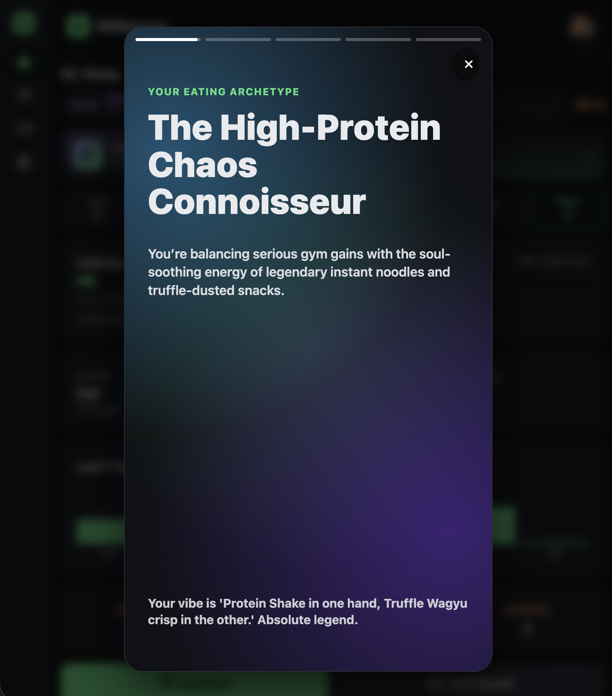
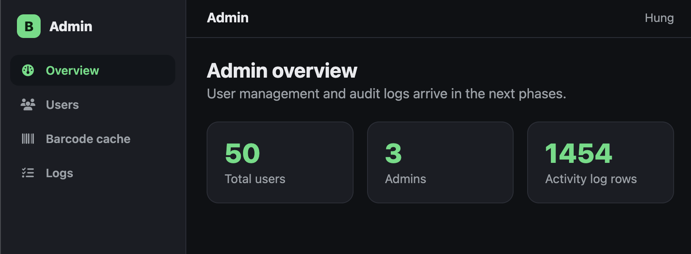

# BitBalance — Vue 3 + Express App

BitBalance is a mobile-first calorie and nutrition tracker that makes logging meals feel
like a game: snap a photo of your food, earn XP for every log, keep your daily streak
alive, unlock achievements, and climb a private leaderboard with friends. On top of the
core tracking flow it adds an AI nutrition coach, a personal-trainer workspace, weekly
"Wrapped" recaps, and an admin panel.

This repository is the **Vue 3 (SPA) + Express (API)** rebuild of the original
[BitBalance PHP project](https://github.com/Kross2710/BitBalance). It reuses the **same
MySQL database** — only the application layer changed (PHP server-rendered pages became an
Express JSON API plus a Vue single-page app). User passwords hashed by the PHP app
(`$2y$` bcrypt) keep working, so existing accounts log in unchanged.

> **Live demo:** https://cusp-ammonium-zipfile.ngrok-free.dev/
>
> The demo runs behind a development tunnel and may be offline outside working hours.



---

## Project motivation

BitBalance started as an educational PHP project and is being migrated to a modern SPA
stack to explore AI-assisted health tracking, gamified habit-building, and a clean,
mobile-first design system — while keeping the existing MySQL data and business logic
intact through a gradual, module-by-module port.

## Technical highlights

- **Session-based authentication** (not JWT) with a 30-day "remember me" token and
  optional **Sign in with Google** (OAuth 2.0 authorization-code flow).
- **AI integration** for food images and chat, abstracted behind a provider layer so the
  backend can target **Gemini** or any **OpenRouter** (OpenAI-compatible) model via config.
- **Same MySQL schema as the PHP app** — no data migration; `bcryptjs` verifies the legacy
  `$2y$` hashes.
- **Single-source design tokens** in `client/src/styles.css` driving a dark, flat, compact,
  mobile-first UI (Font Awesome icons, no emoji).
- **Production-grade session store** (`express-mysql-session`) so logins survive restarts,
  plus `helmet`, rate limiting, and `compression`.
- **One-origin production build**: Vite builds the SPA to `client/dist` and Express serves
  both the app and `/api` from a single port.

---

## Features

**Tracking**
- Daily dashboard: calorie ring, macro progress (P/C/F), a "focus" tile for the macro you
  still need, BMI, a 7-day average, a 7-day bar chart, and a per-meal breakdown.
- Log a meal fast: text entry with autocomplete from your own history, barcode scanning
  (native `BarcodeDetector` with a ZXing fallback for iOS Safari), and **AI photo logging**
  that estimates calories and macros from a single picture.
- Meal types (breakfast / lunch / dinner / snack), inline edit and delete, photo thumbnails.

**Gamification**
- XP and levels, a logging streak, and an achievement system with multi-level badges and
  personal records.
- **BitBalance Wrapped** — a Spotify-Wrapped-style weekly recap (eating archetype, top
  badge, streak, leaderboard, and a bento summary).

**Coaching and social**
- **AI Coach** — a context-aware chat that knows your day's intake, goal, and streak, and
  can turn "I just ate ..." into a ready-to-log card.
- **Personal Trainer** — a two-way client/trainer workspace (chat, advice, goal proposals,
  client management) with a dedicated trainer view.
- **Friends** — search by handle, send/accept requests, a private weekly-XP leaderboard,
  and friend ranks.

**Account and admin**
- Onboarding that computes BMR / TDEE / macro goals, profile editing, meal reminders,
  light/dark theme, and English/Vietnamese (vue-i18n) locales.
- **Admin panel** for user management, activity logs, and the barcode cache (role-gated at
  the router and on every `/api/admin` call).

---

## Screenshots

| | |
|---|---|
|  **Daily dashboard** — calories, macros, streak, 7-day chart |  **Log a meal** — barcode, AI photo, meal types |
|  **AI Coach** — context-aware nutrition chat |  **Friends** — private weekly-XP leaderboard |
|  **Progress** — XP, levels, and achievements |  **BitBalance Wrapped** — weekly recap |


*Admin panel — overview, user management, logs, and barcode cache.*

---

## Architecture

```
client/  → Vue 3 SPA (Vite + vue-router + Pinia). Talks to "/api/..." only.
server/  → Express API. Responses use the envelope { ok, data, message }.
DB       → MySQL (the existing BitBalance schema, reused as-is).
```

- **Dev:** the client runs on `:5173` and Vite proxies `/api` to Express on `:3000`, so
  requests are same-origin and the session cookie works without CORS friction.
- **API envelope:** every response is `{ ok, data, message }`, matching the PHP app's
  `api_send()` so client logic ports almost one-to-one.
- **Auth middleware** reads the current user from the `express-session` row plus the
  remember-me cookie (`currentUserRow(req)`); admin and trainer routes add role guards.
- **Uploads** (AI food photos) are stored on disk and served read-only under
  `/api/uploads/*`.

---

## Tech stack

- **Frontend:** Vue 3, Vite, vue-router, Pinia, `@zxing/browser` (barcode fallback),
  Font Awesome 6 icons. No web fonts (system font stack).
- **Backend:** Node.js, Express, `mysql2`, `express-session` + `express-mysql-session`,
  `bcryptjs`, `multer` + `sharp` (image uploads), `helmet`, `compression`, `cors`,
  `express-rate-limit`, `dotenv`.
- **Database:** MySQL / MariaDB (shared with the PHP app).
- **AI:** Google Gemini or OpenRouter (OpenAI-compatible), selected with `AI_PROVIDER`.
- **Mobile:** `ios-swift/` holds a SwiftUI client that calls the same API. The mobile
  direction is under review (React Native is being considered), so treat the Swift code as
  the prior approach rather than a committed target.

---

## Getting started

**Prerequisites:** Node.js, and a MySQL/MariaDB instance with the BitBalance schema.

```bash
# 1) Backend
cd server
cp .env.example .env        # fill in DB credentials + SESSION_SECRET
npm install
npm run dev                 # http://localhost:3000  (node --watch)

# 2) Frontend (second terminal)
cd client
npm install
npm run dev                 # http://localhost:5173  (Vite proxies /api -> :3000)
```

Open http://localhost:5173 and sign up, or sign in with an existing account.

**Key environment variables** (`server/.env`):

| Variable | Purpose |
|---|---|
| `DB_HOST` / `DB_PORT` / `DB_NAME` / `DB_USER` / `DB_PASSWORD` | MySQL connection |
| `SESSION_SECRET` | secret used to sign the session cookie |
| `COOKIE_SECURE` | `true` when running behind HTTPS in production |
| `GOOGLE_CLIENT_ID` / `GOOGLE_CLIENT_SECRET` | enable Sign in with Google (blank hides it) |
| `AI_PROVIDER` | `gemini` or `openrouter` |
| `GEMINI_API_KEY` / `OPENROUTER_API_KEY` | API key for the chosen AI provider |

**Production build** (one origin):

```bash
cd client && npm run build   # outputs client/dist
cd ../server && npm start     # Express serves the SPA + /api on PORT
```

---

## Project structure

```
client/                 Vue 3 + Vite SPA
  src/styles.css        design tokens (:root variables) — single source of truth
  src/router.js         routes
  src/stores/           Pinia stores (auth, badges, ...)
  src/lib/api.js        axios wrapper around the { ok, data, message } envelope
  src/views/            page-level components (Dashboard, Intake, Coach, Friends, ...)
  src/components/        shared components
  src/layouts/          AppLayout (main nav) and AdminLayout

server/                 Express API
  src/index.js          app entry, middleware, route mounts
  src/db.js             MySQL pool
  src/routes/           auth, intake, dashboard, friends, profile, wrapped, pt, aiCoach, admin, ...
  src/lib/              business logic (xp, streak, achievements, barcode, uploads, ...)
  src/middleware/       session-based auth, rate limiting, timezone

ios-swift/              SwiftUI client (prior approach — direction under review)
```

See [`MIGRATION.md`](MIGRATION.md) for per-endpoint port status, [`DESIGN.md`](DESIGN.md)
for the design system, and [`HANDOFF.md`](HANDOFF.md) for where to resume work.

---

## Security

- Password hashing with bcrypt (`bcryptjs`, compatible with the PHP `$2y$` hashes).
- Session-based access control with a server-side session store and a hashed remember-me
  token (`auth_token`); only the SHA-256 of the validator is stored.
- Parameterized SQL via `mysql2` prepared statements.
- Role-based guards on protected routes (admin and trainer) at both the router and the API.
- `helmet` security headers, per-route rate limiting (login, register, AI endpoints), and
  HTTP-only, `SameSite` session cookies (`Secure` in production).

---

## Design language

Dark, flat, and compact, designed mobile-first and verified at 375px wide.

- Accent `#4ade80`, `1px solid` borders (no chunky 3D shadows), tight padding, content
  capped at `820px`.
- Font Awesome `fa-solid` icons, and **no emoji** anywhere (code, UI, commits, or docs).
- All colors come from CSS tokens in `client/src/styles.css`; see [`DESIGN.md`](DESIGN.md)
  for the full system and anti-patterns.

---

## Relation to the PHP version

This app is a strangler-pattern migration of [BitBalance (PHP)](https://github.com/Kross2710/BitBalance):
modules are ported one at a time onto the same MySQL schema while the PHP app can keep
running for anything not yet moved. The forum is intentionally dropped, and a few PHP
features (for example password-reset email and image export of Wrapped) are not yet ported
— see [`MIGRATION.md`](MIGRATION.md) for the current status.

## License

For educational purposes.
